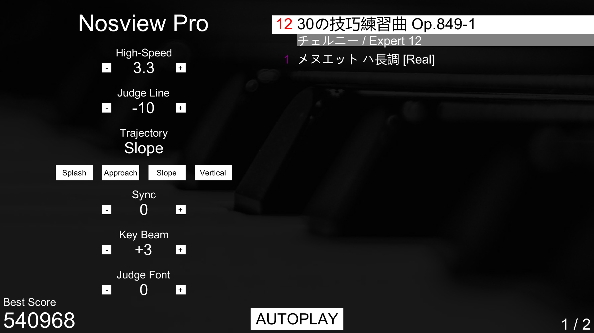
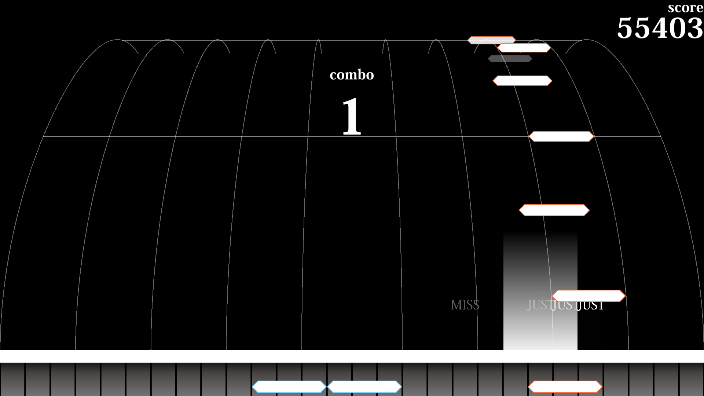
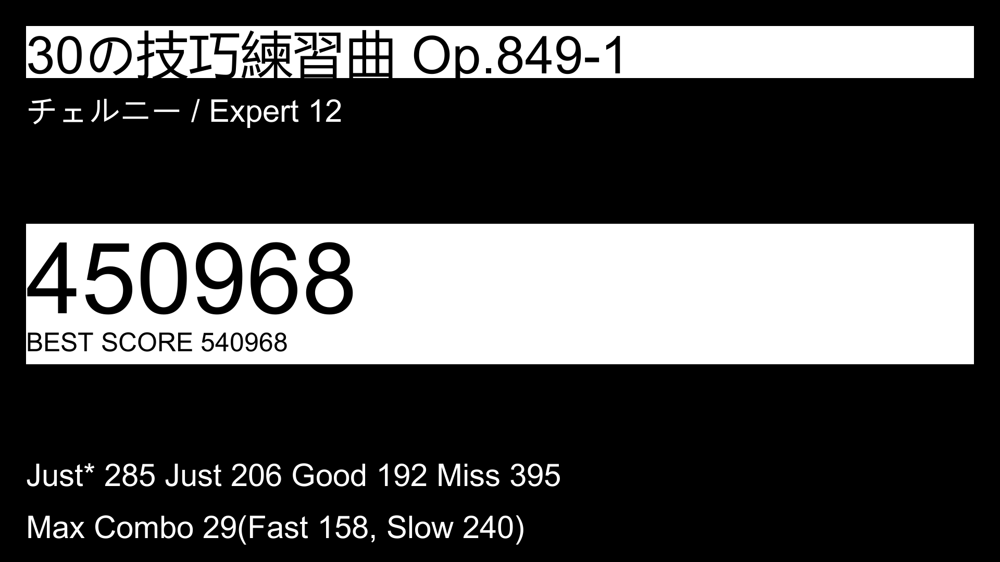

# Nosview Pro, new music game simulator.
Nosview Proは、ピアノをテーマにした音楽演奏シミュレータです。
## 必要仕様
駆動にUnity Playerを利用しますので、最新のUnity Playerを駆動出来る仕様が必要です。それに追加して、情報表記のため***1280 x 720以上のモニタ-ー***が必要です。
### PC
+ OS : Windows 7 (SP1+) / Windows 10 **64bit**
+ CPU : 64bitを支援するCPU [1]
+ GPU : DirectX 10以上を支援するGPU [1]    
[1] 2010年後のCPUはほぼ全部支援するので、OSが64bitなのかどうかだけ確認すればいいです。
### Android
+ OS : Android 4.4+
+ CPU : ARMv7 with Neon Support (32-bit) or ARM64 [2]
+ GPU : OpenGL ES 2.0+, OpenGL ES 3.0+, Vulkanのいずれを支援するGPU [2]
+ RAM : 1GB以上   
[2] これも2015年以後の機種ならほぼ全部支援しますので、RAMとAndroidのバージョンだけ確認すればいいです。   
関連ライブラリーの不在でMIDIキーボードでのプレイは支援しません。
## 推奨仕様
必要仕様のみでは動作を保証出来ません。開発に使ったPCとスマホよりいい仕様なら問題なく動作するはずですが、多分これよりは低い仕様でも普通問題はないと思います。
### PC
+ OS : Windows 10 Pro 64-bit
+ CPU : Intel Core i7-9750H
+ GPU : NVIDIA GTX 1660
+ RAM : DDR4 16GB
+ Resolution : 1920 x 1080 (Full-HD)
### Android (Galaxy S10 5G)
+ OS : Android 10
+ CPU : Samsung Exynos 9820
+ GPU : ARM Mali-G76
+ RAM : LPDDR4X 8GB
+ Resolution : 3040 x 1440
## インストール方法
### PC
1. githubのreleaseページ(https://github.com/exponent-iidx/nosview-pro/releases )から**nosviewpro-pc.zip**ファイルをダウンロードします。
2. 圧縮ファイルを解除すればインストール完了です。
### Android
1. githubのreleaseページ(https://github.com/exponent-iidx/nosview-pro/releases )から**nosviewpro-android.zip**ファイルをダウンロードします。
2. スマホのファイルエクスプローラーなどで**nosviewpro-android.apk**のファイルを実行してインストールします。  
このアプリはAndroidの権限を要求しないのでデバイスの限られた領域のみアクセス出来ます。セキュリティ関連の警告が出れば無視してインストールしてください。
## 譜面ファイルの追加方法
譜面ファイルが音楽を指定しているなら、必ず同じフォルダーに譜面(.nv)ファイルと指定した名前の音楽(.ogg)ファイルを入れてください。
### PC
圧縮ファイルを解除すればBuild,Charts2つのフォルダーが出ます。その中の**Charts**フォルダーに譜面ファイルを追加してください。   
### Android
**/storage/emulated/0/Android/data/com.exponent.nosviewPro/files/Charts**フォルダーに譜面ファイルを追加してください。Chartsフォルダーがない場合はChartsフォルダーを作ってそこに追加してください。
## 実行方法
### PC
**Builds\nosview Pro.exe**を実行してください。
### Android
**nosview Pro**のアプリを実行してください。
## 操作方法
**MIDIキーボードを使いたいプレーヤーは、実行前にDAWなどのMIDIを認識するプログラムを全部終了したから実行してください。認識されない可能性があります。**
### 選曲メニュー
</img>   

左側で設定変更、右側で選曲が出来ます。   
左側で設定可能な事は以下のものです。

- High-Speed : ノーツが落ちるスピードを設定します。 (0.1~9.9)
- Judge Line : 判定ラインの位置を設定します。 (-20~+60, -20で画面の最下段に位置して+60で画面の80%に位置します。)
- Trajectory : ノーツが落ちる軌跡を選択します。 (Splash, Approach, Slope, Vertical)
- Sync : 音楽ファイルがある場合、シンクを調整することが出来ます。
- Key Beam : 押したボタンからビームが表示されるようにします。 (0~10, 0で全然表示されなくて10で画面全体に表示されます)
- Judge Font : 判定テキストの位置を設定します。(0~+5, 0で判定ラインの上で+5で画面の最上段に表示されます)   

下にも情報があります。   

- Best Score : フルコンボしたことがある譜面は追加に**FC**が表示されます。
- AUTOPLAY : 選択した譜面をオートプレイします。
- 1/2 : 現在選曲中の譜面の順番と全体譜面数を表示します。   

キーボードの上下キーのMIDIキーボードの81/83(A5/B5)キー、または譜面をクリック・タッチして曲を選択することが出来ます。   
キーボードのEnterキー、MIDIキーボードの84(C6)キー、または選択した譜面をまたクリック・タッチすればプレイが始まります。

### 譜面プレイ

</img>   

譜面をプレイすることが出来ます。

- キーボードの場合、`/1/2/3/4/5/6/7/8/9/0/-/=/\/Tab/q/w/e/r/t/y/u/i/o/p/[/]/Enter キーを利用してプレイします。
- MIDIキーボードの場合、C2~B5の4オクターブの白健を利用してプレイします。
- Androidでは画面の部分をタッチしてプレイします。

キーボードのEscボタンを押してメインメニューに戻れます。

### リザルト画面

</img>

プレイのリザルト情報を見ます。
画面のタッチ、キーボードのEnterキー、MIDIキーボードの36キー(C2)でメインメニューに戻ります。

## 譜面の作成

譜面の作成にはWeb版Nosview(https://nosdata.info/view/nosview_renewal.html )を利用します。

## 利用時注意事項

- Nosview Proは開発中のものです。これからの開発によってゲームの仕様が変わったり予想されない不具合やデータの破損などが起これる可能性があります。
- 自分が持っている音源での譜面ファイル制作やプレイは自由ですが、その音源を他人に配布する場合、著作権法違反の可能性があります。それにご注意ください。

# Nosview Pro, new music game simulator.
Nosview Pro는, 피아노를 테마로 한 음악 연주 시뮬레이터입니다.
## 필요 사양
구동에 Unity Player를 이용하기 때문에, 최신 Unity Player를 구동하기 위한 사양을 필요로 합니다. 거기에 추가로, 정보 표시를 위해서 ***1280 x 720이상의 모니터***가 필요합니다.。
### PC
+ OS : Windows 7 (SP1+) / Windows 10 **64bit**
+ CPU : 64bit를 지원하는 CPU [1]
+ GPU : DirectX 10이상을 지원하는 GPU [1]    
[1] 2010년 이후의 부품의 경우 거의 지원하므로、OS가 64bit인지의 여부만 확인하시면 됩니다.
### Android
+ OS : Android 4.4+
+ CPU : ARMv7 with Neon Support (32-bit) or ARM64 [2]
+ GPU : OpenGL ES 2.0+, OpenGL ES 3.0+, VulkanGPU 중 하나를 지원하는 GPU [2]
+ RAM : 1GB이상
[2] 이 역시 2015년 이후 기종에선 대체로 만족하므로, 안드로이드 OS 및 RAM 용량 정도만 확인하시면 됩니다.   
Android 버전에서는 라이브러리의 부재로 MIDI 키보드 플레이를 지원하지 않습니다.
## 권장 사양
필요사양은 어디까지나 Unity Player가 구동 가능하다는 뜻으로, 정상 작동을 보장하지 않습니다. 개발 환경만큼 좋은 성능은 필요로 하지 않을 것이라 생각하지만, 개발시 사용한 노트북과 핸드폰의 성능을 첨부합니다.
### PC
+ OS : Windows 10 Pro 64-bit
+ CPU : Intel Core i7-9750H
+ GPU : NVIDIA GTX 1660
+ RAM : DDR4 16GB
+ Resolution : 1920 x 1080 (Full-HD)
### Android (Galaxy S10 5G)
+ OS : Android 10
+ CPU : Samsung Exynos 9820
+ GPU : ARM Mali-G76
+ RAM : LPDDR4X 8GB
+ Resolution : 3040 x 1440
## 인스톨 방법
### PC
1. github의 release 페이지(https://github.com/exponent-iidx/nosview-pro/releases )에서**nosviewpro-pc.zip** 파일을 받아주세요.
2. 압축 파일을 해제하시면 인스톨 완료입니다.
### Android
1. github의 release 페이지(https://github.com/exponent-iidx/nosview-pro/releases )에서**nosviewpro-android.zip** 파일을 받아주세요.
2. 압축 파일을 해제하시고 **nosviewpro-android.apk**의 파일을 스마트폰에서 실행해 설치해 주세요.   
설치 시 보안 경고가 나올 수도 있습니다만, 본 어플리케이션은 권한을 일체 요구하지 않아 본 앱이 설치된 디렉토리 이외의 파일에 접근할 수 없습니다. 안심하고 설치하셔도 괜찮습니다.
## 채보 파일의 추가 방법
.nv 파일을 제작할 때 음악 파일을 지정했을 경우. .nv 파일과 지정된 음악 파일(.ogg)를 같은 폴더 안에 넣어주세요.
### PC
압축을 풀면 Charts, Build 폴더가 나오게 되는데, 채보 파일의 경우 Charts 안에 넣으면 됩니다.
### Android
**/storage/emulated/0/Android/data/com.exponent.nosviewPro/files/Charts**폴더에 채보 파일을 넣어 주세요. files 안에 Charts 폴더가 없을 경우 해당 디렉토리를 만든 이후에 넣어 주세요.
## 실행 방법
### PC
**Builds\nosview Pro.exe**를 실행해 주세요.
### Android
**nosview Pro**의 어플을 실행해 주세요.
## 조작 방법
**MIDI키보드를 사용하실 플레이어분은, 실행하기 전에 DAW 프로그램 등의 미디 파일을 인식하는 프로그램을 모두 종료해주세요. MIDI가 인식되지 않을 가능성이 있습니닫.**
### 선곡 메뉴
</img>   

왼쪽에서 설정 변경, 오른쪽에서 선곡이 가능합니다.
왼쪽에서 설정 가능한 것들은 다음과 같습니다.

- High-Speed : 노트가 떨어지는 속도를 조절합니다. (0.1~9.9)
- Judge Line : 판정 라인의 위치를 조절합니다. (-20~+60, -20의 경우 바닥에 위치하며 +60의 경우 화면 상단 80%에 위치합니다.)
- Trajectory : 노트가 떨어지는 궤적을 조절합니다. (Splash, Approach, Slope, Vertical)
- Sync : 음악 파일이 있는 경우, 싱크를 조절합니다.
- Key Beam : 누른 버튼에서 빔이 나오도록 설정합니다. (0~10, 0의 경우 표시되지 않으면 10의 경우 화면 끝까지 닿습니다)
- Judge Font : 판정 텍스트의 표시 위치를 설정합니다. (0~+5, 0에선 판정선 바로 위에 있으며 +5의 경우 화면 맨 위에 있습니다.)   

아래에도 정보가 있습니다.   

- Best Score : 풀콤보한 적이 있는 보면의 경우 추가적으로 FC 역시 표시합니다.
- AUTOPLAY : 선택한 채보를 오토플레이 합니다.
- 1/2 : 현재 선택중인 채보의 순서와 전채 채보 수를 표시합니다.   

키보드의 상하 키 내지는 MIDI의 81/83(A5/B5)키, 또는 곡을 터치하거나 플릭하는 것으로 곡을 변경할 수 있습니다.   
키보드 Enter키, MIDI의 84(C6)키, 또는 선택한 보면을 다시 클릭, 터치하는 것으로 플레이를 시작합니다.

### 채보 플레이

</img>   

채보를 플레이하는 것이 가능합니다.

- 키보드의 경우 `/1/2/3/4/5/6/7/8/9/0/-/=/\/Tab/q/w/e/r/t/y/u/i/o/p/[/]/Enter 키로 플레이합니다.
- MIDI 키보드의 경우, C2~B5의 4옥타브의 백건을 이용하여 플레이합니다.
- Android에서는 화면을 터치해서 플레이합니다.

키보드의 ESC버튼을 눌러서 메인 메뉴로 돌아갈 수 있습니다.

### 리절트 화면

</img>

플레이의 리절트 화면을 볼 수 있습니다.
화면을 터치하거나, 키보드의 Enter 키, MIDI키보드의 36 키(C2)로 메인 메뉴로 돌아갑니다.

## 채보의 작성

채보의 작성은 Web판 Nosview(https://nosdata.info/view/nosview_renewal.html )를 이용합니다.

## 이용시 주의 사항

- Nosview Pro는 개발중인 물건입니다. 게임의 내용이 갑자기 크게 바뀌거나 데이터가 유실되는 경우가 있는 점 유의 바랍니다.
- 자신이 가지고 있는 음원으로 채보를 만들고 플레이하는 것은 자유이지만, 해당 음원을 타인에게 배포하는 행위는 저작권법 위반이 될 수 있다는 점을 유의해주시길 바랍니다.
